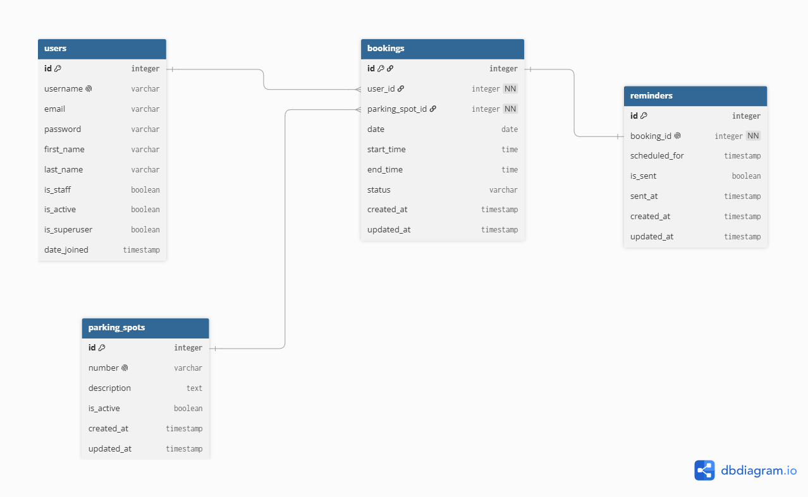
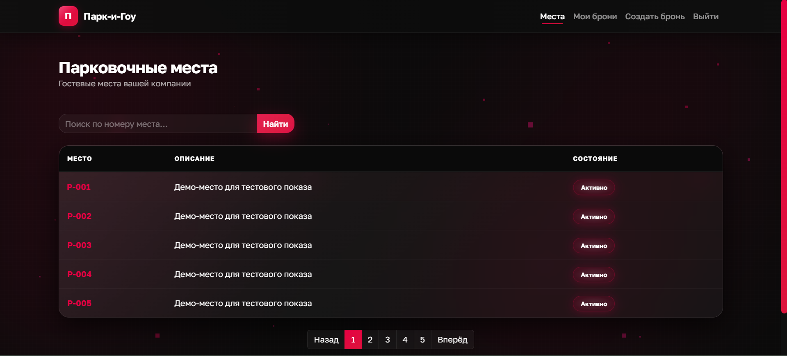
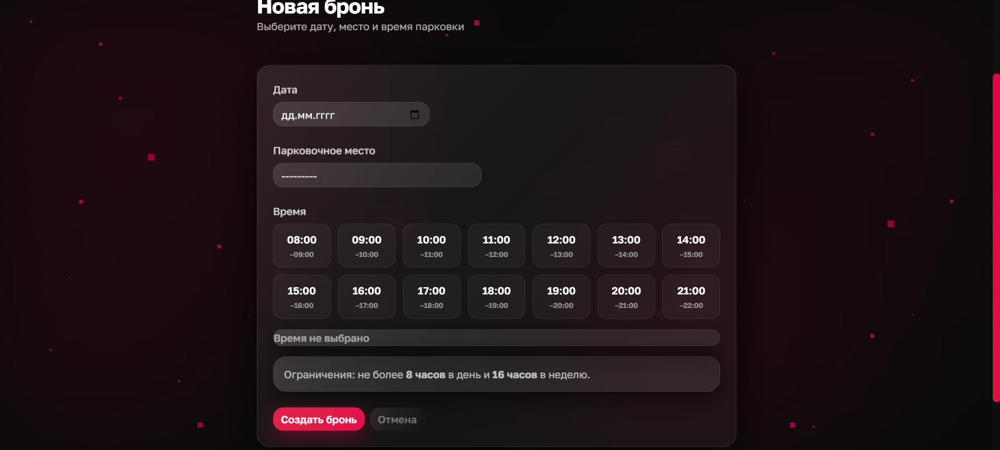
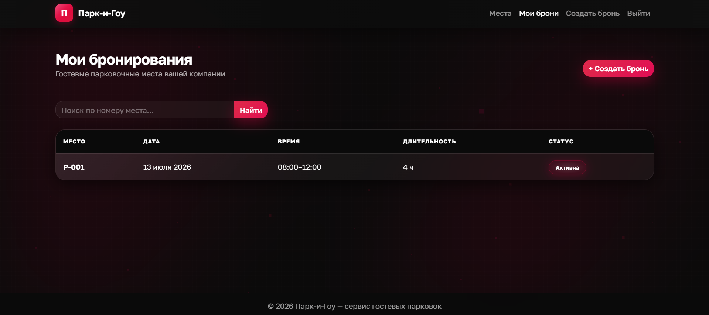

# Парк-и-Гоу

Веб-сервис бронирования гостевых парковочных мест в офисе: без двойных броней, с лимитами и напоминаниями.

Учебный проект стажировки Иви-2026, команда «Пыксели».

## Стек

Python 3.13, Django 6, PostgreSQL 16 (расширение `btree_gist`), Bootstrap 5, Docker Compose (web + PostgreSQL + maildev + nginx), pytest, uv.

## Возможности

- Регистрация, вход (по имени пользователя или email), выход, восстановление пароля по email.
- Полный CRUD брони: создание, просмотр, редактирование, отмена и удаление своих броней.
- Часовые слоты 08:00–22:00; бронирование не дальше чем на 30 дней вперёд; лимиты 8 ч/сутки и 16 ч/неделю.
- Защита от двойной брони на уровне БД (`ExclusionConstraint` + `btree_gist`).
- Календарь загруженности места на месяц с цветовой индикацией (свободно / частично / занято).
- Напоминание о брони на email за сутки до начала (команда `send_reminders`).
- Экспорт CSV-отчёта занятости за неделю для администратора.
- Список с поиском и пагинацией; Django-админка с кастомизацией.

## Как развернуть проект

### Вариант 1 — Docker Compose (рекомендуется)

1. Клонировать репозиторий:

   ```bash
   git clone <ссылка-на-репозиторий>
   cd IVI-PROJECT-PARK-AND-GO
   ```

2. Настроить `.env` (пример — в `.env.example`):

   ```bash
   cp .env.example .env
   ```

3. Поднять контейнеры (миграции применяются автоматически при старте):

   ```bash
   docker compose up --build
   ```

4. Создать суперпользователя:

   ```bash
   docker compose exec web python manage.py createsuperuser
   ```

5. Наполнить демо-парковочными местами (иначе список будет пустым):

   ```bash
   docker compose exec web python manage.py create_demo_spots
   ```

Приложение — <http://localhost:8000> (через nginx, он же отдаёт статику).
Почта (maildev, для просмотра писем-напоминаний) — <http://localhost:1080>.
Админка — <http://localhost:8000/private/admin/>.

Остановить: `docker compose down` (данные в БД сохранятся; `docker compose down -v` — со сносом БД).

### Вариант 2 — локально (без Docker для самого приложения)

PostgreSQL и maildev поднимаем в Docker, приложение — локально в виртуальном окружении.

1. Клонировать репозиторий:

   ```bash
   git clone <ссылка-на-репозиторий>
   cd IVI-PROJECT-PARK-AND-GO
   ```

2. Установить [uv](https://docs.astral.sh/uv/) — менеджер пакетов, которым пользуется проект.

3. Создать окружение и установить зависимости (uv читает `pyproject.toml` и `uv.lock`):

   ```bash
   uv sync --extra dev
   source .venv/bin/activate        # Windows: .venv\Scripts\activate
   ```

4. Настроить `.env`:

   ```bash
   cp .env.example .env
   ```

   В `.env` поменять `DB_HOST` и `EMAIL_HOST` на `localhost`.

5. Поднять только БД и почту в Docker:

   ```bash
   docker compose up -d db maildev
   ```

6. Выполнить миграции:

   ```bash
   python manage.py migrate
   ```

7. Наполнить демо-парковочными местами:

   ```bash
   python manage.py create_demo_spots
   ```

8. Создать суперпользователя:

   ```bash
   python manage.py createsuperuser
   ```

9. Запустить сервер:

   ```bash
   python manage.py runserver
   ```

## Как запустить тесты

```bash
# в Docker
docker compose exec web pytest
docker compose exec web pytest --cov=. --cov-report=term-missing

# локально
pytest
pytest --cov=. --cov-report=term-missing
```

Линтер:

```bash
docker compose exec web ruff check .
# или локально: ruff check .
```

Покрытие кода — около 96%, порог по ТЗ (≥ 70%) выполнен.

## Модели

- **User** (`users`) — кастомный пользователь на базе `AbstractUser` (email, username, пароль и т.д. — стандартные поля Django). Подключён через `AUTH_USER_MODEL`.
- **ParkingSpot** (`spots`) — парковочное место: `number` (уникальный номер, напр. A-12), `description`, `is_active`.
- **Booking** (`bookings`) — бронь: `user` (ForeignKey → User), `parking_spot` (ForeignKey → ParkingSpot), `date`, `start_time`, `end_time`, `status` (активна/отменена), временные метки создания и обновления (`created_at`, `updated_at`). Ограничение уровня БД (`ExclusionConstraint`) не позволяет создать две пересекающиеся активные брони на одно место — защита от гонки при одновременных запросах. Свободные слоты не хранятся отдельно, а вычисляются на лету из активных броней. Бронировать можно не дальше чем на 30 дней вперёд; суточный лимит — 8 часов, недельный — 16 часов на пользователя.
- **Reminder** (`bookings`) — напоминание о брони: `booking` (OneToOne → Booking), `scheduled_for` (за сутки до начала брони), `is_sent`, `sent_at`. Создаётся автоматически при создании брони; рассылается management-командой `send_reminders`.

Связи: ForeignKey (Booking → User, Booking → ParkingSpot), OneToOne (Reminder → Booking).

### ER-диаграмма базы данных



## Скриншоты

| Список мест | Бронирование | Мои брони |
| --- | --- | --- |
|  |  |  |

## Видео-демо

[Видео-демо работы приложения](docs/demo/demo.mp4)

## Техническое задание

См. `docs/ТЗ.pdf`.

## Ручки

| URL | Назначение | Доступ |
| --- | --- | --- |
| `/` | Редирект на список парковочных мест | все |
| `/spots/` | Список парковочных мест | все |
| `/spots/<id>/` | Детали места и актуальные бронирования | все |
| `/spots/<id>/calendar/` | Календарь загруженности места на месяц | все |
| `/orders/` | Мои бронирования: поиск, пагинация | вошедший |
| `/orders/new/` | Создать бронь | вошедший |
| `/orders/<id>/` | Детали брони | вошедший |
| `/orders/<id>/edit/` | Редактировать бронь | владелец |
| `/orders/<id>/cancel/` | Отменить бронь (POST) | владелец |
| `/orders/<id>/delete/` | Удалить бронь | владелец |
| `/accounts/register/` | Регистрация | гость |
| `/accounts/login/` | Вход (по имени пользователя или email) | гость |
| `/accounts/logout/` | Выход (POST) | вошедший |
| `/accounts/password-reset/` | Восстановление пароля по email | гость |
| `/private/admin/` | Django-админка | суперюзер |
| `/private/admin/spots/parkingspot/weekly-report/` | Экспорт CSV-отчёта занятости за неделю | суперюзер |

Неавторизованного с любой ручки `/orders/…` редиректит на страницу входа с `?next=`.

## Структура проекта

- Настройки разбиты по модулям: `application/settings/{base,database,auth,email,test}.py`.
- Общие поля моделей (`created_at`, `updated_at`) — в миксине `core.models.TimeStampedModel`.
- Зависимости и настройки инструментов (ruff, pytest) — в `pyproject.toml`, версии зафиксированы в `uv.lock`; Docker-образ ставит пакеты через `uv`.
- Демо-парковочные места не зашиты в миграции, а создаются командой `python manage.py create_demo_spots` (`--count` задаёт количество).
- Конфигурация — только через `.env` (см. `.env.example`); `docker-compose.yml` берёт значения оттуда же.
